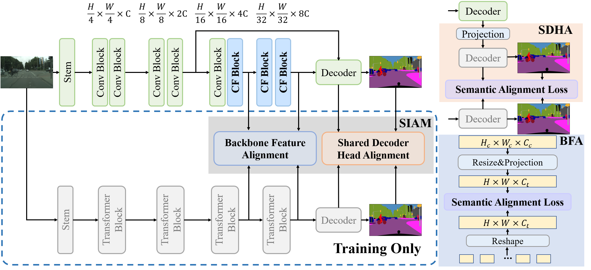

# SCTNet: Single-Branch CNN with Transformer Semantic Information for Real-Time Segmentation

This repository contains the official Pytorch implementation of training & evaluation code and the pretrained models for [SCTNet](https://arxiv.org/abs/2312.17071)(AAAI24)🔥

<!--  -->

<div align="center">
  
</div>
<p align="center">
  Figure 1: The architecture of SCTNet. CFBlock (Conv-Former Block) takes advantage of the training-only Transformer branch (greyed-out in the dashed box) via SIAM (Semantic Information Alignment Module) which is composed of BFA (Backbone Feature Alignment) and SDHA (Shared Decoder Head Alignment).
</p>

SCTNet is a powerful real-time semantic segmentation method, as shown in Figure 1.

## Installation
We use [MMSegmentation v0.26.0](https://github.com/open-mmlab/mmsegmentation/tree/v0.26.0) as the codebase. 
An example (works for me): ```CUDA 11.3``` and  ```pytorch 1.10.0```
### Environment Installation
```
conda create -n SCTNet python=3.8
conda activate SCTNet
conda install pytorch==1.11.0 torchvision==0.12.0 torchaudio==0.11.0 cudatoolkit=11.3 -c pytorch

pip install mmcv-full==1.6.0 -f https://download.openmmlab.com/mmcv/dist/cu113/torch1.11.0/index.html
pip install timm
pip install matplotlib
pip install prettytable
pip install einops
```
If you have problems about mmcv-full installation, please refer to the guidelines [MMCV](https://mmcv.readthedocs.io/zh-cn/v1.6.0/get_started/installation.html)

### Data Preparation
```
cd your_codebase_path/SCTNet
#ADE20K
ln -s your_ADE20K_path  data/ade/
#COCO-Stuff-10K
ln -s your_COCO-Stuff-10K_path  data/
#cityscapes
ln -s your_citscapes_path  data/
```
If you need more details about data preparation, please refer to the guidelines in [MMSegmentation_dataset_prepare.md](https://github.com/open-mmlab/mmsegmentation/blob/0.x/docs/en/dataset_prepare.md)


## Results and models

### ADE20K
| Method  | mIoU(ss) | FPS(torch) | Model |
| ------- | -------- | --------- |--------- |
| SCTNet-S | 37.91  | 158.4  | [model](https://drive.google.com/file/d/1U5OXyFDBYd3bZLKIAg64BFU-zPDbaO6d/view?usp=sharing)|
| SCTNet-B | 43.04  | 145.1  | [model](https://drive.google.com/file/d/1Ox-51cz9UZGi7S4XiwRyoSGpJegwzcC3/view?usp=sharing)|

### COCO-Stuff-10K
| Method  | mIoU(ss) | FPS(torch) | Model |
| ------- | -------- | --------- |--------- |
| SCTNet-B | 35.91  | 141.5   |[model](https://drive.google.com/file/d/1lYAJBdJBCOKzJnD-ipveouRmzlCmLlwj/view?usp=sharing)|


### Cityscapes
| Method  | mIoU(ss) | FPS(torch) | FPS(Tensor-RT) |Model |
| ------- | -------- | --------- | --------- |--------- |
| SCTNet-S-Seg50 | 72.94  | 160.3   | 451.2  |[model](https://drive.google.com/file/d/16fAVzvb_qLcFO3dVGdHsSkEMvVCslXcD/view?usp=sharing)|
| SCTNet-S-Seg75 | 76.33  | 149.2   | 233.3  |[model](https://drive.google.com/file/d/1W_VMV8P77Z4GIB_O7WQQivWLH4t-rbBm/view?usp=sharing)|
| SCTNet-B-Seg50 | 76.46  | 144.9   | 374.6  |[model](https://drive.google.com/file/d/1gHo655PDo-hUxCNlZNqrLIFOgc_14Wbl/view?usp=sharing)|
| SCTNet-B-Seg75 | 79.83  | 105.2   | 186.6  |[model](https://drive.google.com/file/d/1JXvSlaNbEbsG87wIwD1lhDQDeku9Wfed/view?usp=sharing)|
| SCTNet-B-Seg100 | 80.51  | 62.8   | 105.0  |[model](https://drive.google.com/file/d/1yRKatICzgnslqcHvL_AiwRXyIvuDDM6x/view?usp=sharing)|


## Evaluation

Download the above `Model`.

Example: evaluate ```SCTNet-B``` on ```ADE20K``` :

```
# Single-gpu testing
python tools/test.py configs\sctnet\ADE20K\sctnet-b_8x4_160k_ade.py /path/to/SCTNet-B-ADE20K.pth  --eval mIoU

# Multi-gpu testing, 2 gpu
bash tools/dist_test.sh configs\sctnet\ADE20K\sctnet-b_8x4_160k_ade.py /path/to/SCTNet-B-ADE20K.pth 2 --eval mIoU
```
ps: You can remove auxiliary_head and backbone.init_cfg in the corresponding configs. This will allow you to test without downloading pretrain weights and remove some warnings in weight loading.
## Training

Download `pretrain weights`
(
[google drive](https://drive.google.com/drive/folders/1s212C75bh5QHi5JevNg405cjmeR_rDcI?usp=sharing) ), and put them in a folder ```pretrained/```.

Example: train ```SCTNet-base``` on ```ADE20K```:

```
# 4 gpus, batch_per_gpu=4 , btachsize =16
bash tools/dist_train.sh configs\sctnet\ADE20K\sctnet-b_8x4_160k_ade.py 4
```
train ```SCTNet-slim``` on ```Cityscapes```:

```
# 2 gpus, batch_per_gpu=8 , btachsize =16
bash tools/dist_train.sh configs\sctnet\cityscapes\sctnet-s_seg75_8x2_160k_cityscapes.py 2
```


## Speed

````bash
cd ./speed
````
* Measure the inference speed of SCTNet-B-Seg100 for Cityscapes:
````bash
python torch_speed.py --type sctnet-b-seg100
````
* Measure the inference speed of SCTNet-S for ADE20K:
````bash
python torch_speed.py --type --a sctnet-s-ade
````

We use the latency measurement code of PIDNet for torch speed measurement. For Tensor-RT speed, please follow the [instructions](https://github.com/open-mmlab/mmdeploy/tree/0.x) to install mmdeploy(v0.12.0). The Tensor-RT Speed of all methods mentioned in the paper is measured under FP16 and the mmdeploy library. All speeds are measured on an RTX 3090, and the actual speed may vary depending on the device you are using.


## Citation

If you find this work helpful to your research, please consider citing the paper:

```bibtex
@article{xu2023sctnet,
  title={SCTNet: Single-Branch CNN with Transformer Semantic Information for Real-Time Segmentation},
  author={Xu, Zhengze and Wu, Dongyue and Yu, Changqian and Chu, Xiangxiang and Sang, Nong and Gao, Changxin},
  journal={arXiv preprint arXiv:2312.17071},
  year={2023}
}
```

## License
 The code is released under the MIT license[](https://opensource.org/licenses/MIT).

## Acknowledgement
* Our implementation is modified based on [MMSegmentation](https://github.com/open-mmlab/mmsegmentation/tree/v0.26.0).
* Latency measurement code is modified from the [PIDNet](https://github.com/XuJiacong/PIDNet).
* Thanks for their nice contribution.
